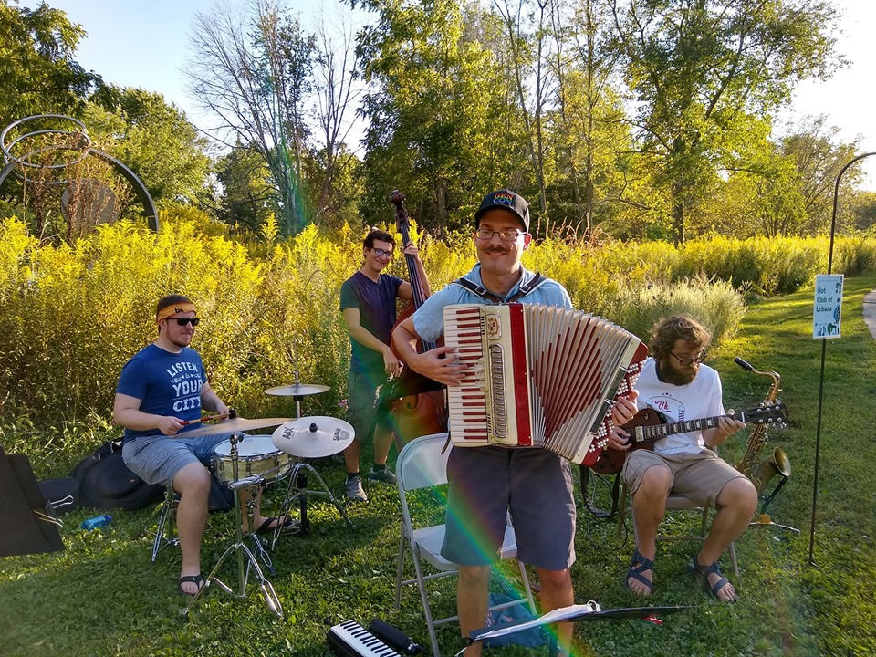
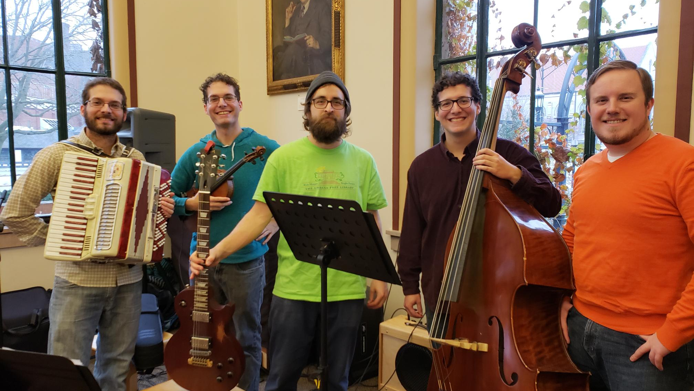

# Hot Club of Urbana

We play energetic Hot Club Jazz music!

{width="40%"}

## Who We Are
- Rob Sweedler on the accordion. 
- Ben Sweedler violin. 
- Louie Papas on the guitar.
- Jeff Sweedler on the upright bass.
- Will Andresen on the drums.

{width="30%"}

## What is Hot Club Jazz?
Hot Club Jazz comes from the 1930’s jazz scene in Europe. It was pioneered by Romani guitarist Django Reinhardt, French violinist Stephane Grappelli and their band the Hot Club de France.